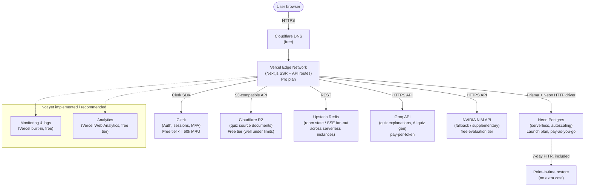

# QuizzX — Infrastructure Cost & Deployment Funding Proposal

**Prepared for:** i-Create Funding Committee
**Prepared:** 2026-07-22
**Scope:** Deployment and production infrastructure costs only (not development labor)

> **Note on source material.** The repository does not contain a filled-in `i-Create Project Proposal.md` — only the blank format template (`i-Create Project Proposal Format.md`). This document is therefore built entirely from the actual codebase (schema, dependencies, environment variables, comments), not from a pre-written proposal narrative.

---

## 1. Executive Summary

QuizzX is a Next.js 16 competitive quiz platform (auth, quizzes, live multiplayer rooms, teams, leaderboards, achievements, AI-assisted quiz generation) currently in early implementation: the auth flow, database schema, and marketing landing page exist; the quiz-taking, room, and AI-generation API routes do not yet exist in the repository. The `.env.local.example` file, however, explicitly names the intended production services, which this proposal treats as the target architecture.

At the target scale of **1,000 concurrent active users**, the infrastructure is dominated by two genuinely usage-based line items — **Neon Postgres compute** and **Groq AI tokens** — while **Clerk auth (free up to 50,000 MRU), Cloudflare R2 storage, DNS, CI/CD, and secrets management cost $0/month** at this scale. The realistic modeled monthly cost is **$54–$92**, i.e. **$648–$1,106/year**, dominated by Vercel's mandatory $20/month Pro plan (Hobby/free tier legally forbids commercial use) and Neon compute.

The single largest scaling risk is not compute — it's **Clerk's per-MRU pricing once you cross 50,000 monthly retained users**, which turns a $0 line item into the largest single cost in the stack (modeled at **~$1,025/month** at 100,000 MAU). This is flagged explicitly in Section 8.

**Funding recommendation:** Minimum **$200**, Comfortable **$950**, Ideal **$1,850** (12 months + scale-up buffer). Full justification in Section 11.

---

## 2. Deployment Architecture

| Layer | Service | Evidence in repo |
|---|---|---|
| Frontend + Backend (SSR, API routes) | **Vercel** (Next.js) | `package.json` (`next@16.2.11`), `README.md` explicitly recommends Vercel deploy, no Dockerfile/`fly.toml`/`railway.toml`/`render.yaml` present |
| Database | **Neon Postgres** (serverless) | `@neondatabase/serverless`, `@prisma/adapter-neon` in `package.json`; `DATABASE_URL`/`DIRECT_URL` in `.env.local.example` explicitly reference Neon's pooled/direct connection pattern |
| ORM | **Prisma 7.9** (`prisma-client` generator, driver adapter mode) | `prisma/schema.prisma`, `prisma.config.ts` |
| Auth | **Clerk** | `@clerk/nextjs@7.5.21`, `lib/auth.ts`, `proxy.ts` (Clerk middleware) |
| Object storage | **Cloudflare R2** | `.env.local.example` (`R2_ACCOUNT_ID`, `R2_BUCKET_NAME=quizzx-uploads`, etc.) — for the original uploaded quiz document (`.docx`/`.txt`/`.md`) |
| AI inference | **Groq** + **NVIDIA NIM** | `.env.local.example` (`GROQ_API_KEY`, `NVIDIA_NIM_API_KEY`) — quiz explanations, AI-authored quizzes, daily challenge |
| Cache / realtime fan-out | **Redis** (optional per comment; Upstash recommended) | `.env.local.example` (`REDIS_URL`, comment: "only needed if running more than one app instance") |
| Email (auth) | **Clerk-managed** (no separate service) | No `resend`/`postmark`/`nodemailer` dependency anywhere in `package.json` |
| Domain / DNS / CDN / monitoring / analytics / CI-CD | **Not present in repo** — recommended below | No `vercel.json`, no `.github/workflows`, no Sentry/PostHog/analytics dependency |

### What could NOT be determined from the repository
- No app/api route handlers exist yet, so actual request volume, AI-call frequency, and R2 upload frequency cannot be measured — they are modeled (Section 6) with assumptions stated explicitly.
- No monitoring, logging, or analytics service is wired up (only a `LOG_LEVEL` env var). This proposal recommends free-tier options rather than inventing a cost for something not built.
- No domain has been registered yet.
- Team size (number of Vercel seats needed) is unknown — repo has a single committer to date; this proposal assumes 1 seat.

---

## 3. Infrastructure Diagram

---

## 4. Technology Stack

| Category | Technology | Version (from `package.json`) |
|---|---|---|
| Framework | Next.js | 16.2.11 |
| UI runtime | React / React DOM | 19.2.4 |
| Language | TypeScript | ^5 |
| Styling | Tailwind CSS | ^4 |
| Animation | Framer Motion, Lenis | ^12.42.2 / ^1.3.25 |
| Auth | Clerk (`@clerk/nextjs`) | ^7.5.21 |
| ORM | Prisma (`@prisma/client`, `prisma`) | ^7.9.0 |
| DB driver | `@neondatabase/serverless`, `@prisma/adapter-neon` | ^1.1.0 / ^7.9.0 |
| Image processing | sharp (Prisma-related build dep) | 0.34.5 |

No AWS SDK, Redis client, email SDK, or AI SDK package is present in `package.json` yet — R2, Redis, Groq, and NVIDIA NIM integrations exist only as environment-variable scaffolding, not working code, at the time of this analysis.

---

## 5. Production Architecture (design decisions and why)

- **Vercel over Railway/Render/Fly/Hetzner/AWS**: the app has zero containerization artifacts and uses Neon's HTTP-based serverless driver, which is purpose-built for edge/serverless request-response execution — the exact model Vercel provides. Any of the container-based alternatives would require writing a Dockerfile and abandoning the HTTP driver adapter already chosen in `lib/prisma.ts`.
- **Neon over a self-hosted/RDS Postgres**: scale-to-zero and per-CU-hour billing matches a pre-revenue product with bursty (school/exam-hours) traffic far better than a fixed always-on instance. The `DIRECT_URL`/`DATABASE_URL` split in `.env.local.example` already assumes Neon's pooled-vs-direct connection model.
- **Clerk over rolling custom auth**: already implemented; free up to 50,000 MRU, which comfortably covers the 1,000-concurrent target (Section 6).
- **Cloudflare R2 over S3/Vercel Blob**: R2 has **zero egress fees** (confirmed on Cloudflare's official pricing page), which matters because quiz documents are served back to users; S3 or Vercel Blob would add a bandwidth-cost line item R2 avoids entirely.
- **Upstash Redis over self-hosted Redis**: serverless functions on Vercel are stateless and horizontally scaled by design; the `Room`/`RoomParticipant` models in `prisma/schema.prisma` imply live multiplayer state that must be shared across concurrently-running function instances. A REST-based, pay-per-request Redis (Upstash) fits this without maintaining a persistent connection pool from serverless functions.
- **Groq as primary AI billing target, NVIDIA NIM as free fallback**: Groq publishes exact, verifiable per-token pricing (Section 7); NVIDIA's hosted NIM catalog pricing could not be independently verified in this research pass (see Section 7 caveat), so it is treated as a free, rate-limited supplementary tier rather than a budgeted cost.

---

## 6. Scale Assumptions (stated explicitly — the repo has no usage telemetry to draw from)

The brief specifies **1,000 concurrent active users**. Concurrency and Monthly Active Users (MAU) are different metrics; no historical data exists in this pre-launch repo to derive a ratio, so this proposal uses a stated, industry-typical assumption:

> **Assumption:** 1,000 *concurrent* peak users (e.g., a live class-wide quiz event) corresponds to roughly **10,000 Monthly Active Users**, using a ~10:1 MAU-to-peak-concurrency ratio typical of session-based engagement apps. All "realistic" figures below use 10,000 MAU / 1,000 peak concurrent as the baseline. Section 8 scales this baseline ×2 and ×10.

Derived per-service assumptions (all stated, none hidden):
- Avg. 8 sessions/user/month, ~15 HTTP requests/session (page loads + API calls) → **1.2M function invocations/month**.
- Avg. page/asset weight served from Vercel edge ≈ 2MB/session → **~160GB/month fast data transfer** (well under Vercel Pro's 1TB included).
- Quiz documents: ~500 creators uploading ~1 document/month at ~200KB each → **~100MB/month R2 growth**, negligible reads/writes relative to R2's free-tier limits.
- AI usage: 1 daily-challenge generation/day (shared, cached) + ~500 AI-authored quizzes/month + ~10,000 on-demand explanation calls/month.
- Neon compute: modeled as a range because Neon autoscales to zero when idle and the repo has no traffic pattern to fix a single number — **"light" = 4 avg active compute hours/day, "heavy" = 12 avg active compute hours/day**, both at ~1.5 CU average.
- Redis: live-room state updates modeled at ~5 commands/sec sustained over ~2 peak hours/day.

These are modeling inputs, not measurements — they are the basis for every dollar figure in Section 7, and are called out again wherever they drive a number.

---

## 7. Detailed Cost Breakdown (Realistic Production Scenario: 1,000 peak concurrent / ~10,000 MAU)

### 7.1 Vercel — Frontend + Backend Hosting
- **Purpose:** SSR rendering, API routes, edge network, build/CI.
- **Tier:** Pro, $20/user/month, 1 seat.
- **Why this tier:** Vercel's own docs state the Hobby (free) plan "restricts users to non-commercial, personal use only" — a funded product cannot legally run on it.
- **Included:** 1,000,000 function invocations, 1TB fast data transfer, 10,000,000 edge requests, 5,000 image transformations/month.
- **Modeled usage:** ~1.2M invocations (0.2M over → $0.60/M overage = **$0.12**), ~160GB transfer (under limit, $0).
- **Monthly cost: $20.12** | **Annual: $241.44**
- Source: [vercel.com/pricing](https://vercel.com/pricing), [vercel.com/docs/plans/hobby](https://vercel.com/docs/plans/hobby)

### 7.2 Neon — Database
- **Purpose:** Primary Postgres database (all 12 models in `prisma/schema.prisma`).
- **Tier:** Launch (pay-as-you-go, no fixed base fee).
- **Pricing:** $0.106/CU-hour compute, $0.35/GB-month storage, 10 branches included ($1.50/branch-month beyond that — not needed at this scale).
- **Modeled usage:** compute = 4–12 avg active hrs/day × ~1.5 CU × 30 days = 180–540 CU-hours/month → **$19.08–$57.24**. Storage: ~5GB after year one (mostly `submission_events` rows from tab-switch/answer tracking) → **$1.75**.
- **Monthly cost: $20.83–$58.99** | **Annual: $250–$708**
- Backups: 7-day point-in-time restore is **included** in the Launch plan at no extra cost.
- Source: [neon.com/pricing](https://neon.com/pricing)

### 7.3 Clerk — Authentication
- **Purpose:** Sign-up/sign-in, session management, admin-email promotion (`lib/auth.ts`).
- **Tier:** Free — up to **50,000 Monthly Retained Users** per app.
- **Modeled usage:** ~10,000 MAU, comfortably inside the free limit.
- **Monthly cost: $0** | **Annual: $0**
- Source: [clerk.com/pricing](https://clerk.com/pricing)

### 7.4 Cloudflare R2 — Object Storage
- **Purpose:** Persisting the original uploaded quiz source document (`.docx`/`.txt`/`.md`).
- **Tier:** Free (Standard storage: 10GB, 1M Class A ops, 10M Class B ops/month included).
- **Modeled usage:** ~100MB/month growth, negligible ops — inside every free-tier limit.
- **Egress:** confirmed **free** regardless of tier ("Egressing directly from R2 ... does not incur data transfer charges").
- **Monthly cost: $0** | **Annual: $0**
- Source: [developers.cloudflare.com/r2/pricing](https://developers.cloudflare.com/r2/pricing/)

### 7.5 Groq — AI Inference (primary)
- **Purpose:** AI-authored quizzes, quiz explanations, daily challenge generation.
- **Pricing used:** Llama 3.1 8B Instant ($0.05/M in, $0.08/M out) for lightweight explanation calls; Llama 3.3 70B Versatile ($0.59/M in, $0.79/M out) for full quiz authoring.
- **Modeled usage:** ~500 AI-authored quizzes/month (≈1.5M in + 1M output tokens) + ~10,000 explanation calls/month (≈3M in + 2M output tokens on the 8B model) + negligible daily-challenge cost.
- **Monthly cost: ≈ $2.13** (70B quiz-authoring: $0.885+$0.79 = $1.68; 8B explanations: $0.15+$0.16 = $0.31; daily challenge <$0.10) | **Annual: ≈ $26**
- Note: Groq's published free tier (30 RPM / 14,400 requests/day, per third-party trackers, not an official pricing-page line item) would be exhausted well before 10,000 monthly explanation calls at peak hours, so this proposal budgets the paid pay-as-you-go rate rather than assuming free usage.
- Source: [groq.com/pricing](https://groq.com/pricing)

### 7.6 NVIDIA NIM — AI Inference (fallback/supplementary)
- **Purpose:** Secondary AI provider referenced in `.env.local.example` (`NVIDIA_NIM_API_KEY`).
- **Status: pricing could not be verified from an official NVIDIA source.** `build.nvidia.com` blocked automated retrieval on every attempt in this research pass (timeouts / 403). NVIDIA's publicly documented model is a rate-limited free evaluation tier on the hosted API catalog, with production/high-volume use requiring either metered per-token billing (third-party trackers report a wide, unverified $0.04–$1.20/M token range) or a self-hosted NIM container under an NVIDIA AI Enterprise license.
- **Treatment in this budget:** assumed **$0/month**, used only within its free rate limit as a fallback to Groq. **This is the one line item in this proposal that is not backed by an official pricing citation — do not rely on it remaining free if usage grows; verify directly with NVIDIA before committing production traffic to it.**

### 7.7 Upstash Redis — Realtime/Cache
- **Purpose:** Cross-instance state for live multiplayer rooms (`Room`/`RoomParticipant` models) — required once the app runs as multiple concurrent serverless function instances, not "optional" as the current `.env.local.example` comment (written for single-instance dev) suggests.
- **Tier chosen:** Fixed $10/month plan (250MB, unlimited commands) — chosen over pay-as-you-go ($0.20/100K commands) for **billing predictability**, since live-room traffic is bursty and hard to bound in advance.
- **Modeled usage:** ~5 commands/sec × 2 peak hrs/day × 30 days ≈ 1.08M commands/month, which would cost ~$2.16 on pay-as-you-go — the fixed plan is a deliberate $7.84/month premium for predictability, not the cheapest option.
- **Monthly cost: $10** | **Annual: $120**
- Source: [upstash.com/pricing](https://upstash.com/pricing)

### 7.8 Domain Registration
- **Provider:** Porkbun (chosen over Namecheap specifically because Porkbun publishes one flat, unchanging price — "the price you see is the price you pay, year after year," confirmed on their own pricing page — avoiding the registration/renewal price gap common elsewhere).
- **.com domain: $11.08/year** (registration = renewal, no bait-and-switch).
- **Monthly-equivalent: $0.92** | **Annual: $11.08**
- Source: [porkbun.com/tld/com](https://porkbun.com/tld/com)

### 7.9 DNS
- **Provider:** Cloudflare (free plan) — natural pairing since R2 already requires a Cloudflare account.
- **Cost: $0/month.** Free plan includes unlimited DNS records, universal SSL, and basic DDoS protection.

### 7.10 CDN / Image Delivery
- Handled by Vercel's edge network (already billed in 7.1) for the app itself, and by R2's free egress (7.4) for quiz documents. **No separate CDN cost.** Fonts are self-hosted in `app/fonts/` (no third-party font-CDN dependency, e.g. no Google Fonts call).

### 7.11 Monitoring, Logging, Analytics
- **Not implemented in the codebase today** (no Sentry/Datadog/PostHog/Vercel-Analytics dependency; only a `LOG_LEVEL` env var).
- **Recommended, not currently budgeted:** Vercel's built-in Runtime Logs (1-day retention, included free in Pro) for basic operational visibility; add Vercel Web Analytics only if the 50,000-events/month free allotment is acceptable (at 10,000 MAU × ~40 pageviews/month this would be exceeded, so full analytics is flagged as a future paid add-on rather than budgeted here).
- **Cost: $0/month** at MVP scope; this is a real gap the team should close before launch, not an omission from this proposal.

### 7.12 Secrets Management & CI/CD
- **Secrets:** Vercel Environment Variables — included in the Pro plan, $0 extra.
- **CI/CD:** Vercel's native Git integration (auto build + deploy per push/PR) — no GitHub Actions workflow exists, none needed; $0 extra.

### Total Monthly Cost (Realistic Scenario)

| Item | Low | High |
|---|---:|---:|
| Vercel Pro | $20.12 | $20.12 |
| Neon | $20.83 | $58.99 |
| Clerk | $0 | $0 |
| Cloudflare R2 | $0 | $0 |
| Groq | $2.13 | $2.13 |
| NVIDIA NIM | $0 | $0 |
| Upstash Redis | $10.00 | $10.00 |
| Domain (amortized) | $0.92 | $0.92 |
| DNS / CDN / Monitoring / Secrets / CI-CD | $0 | $0 |
| **Total** | **$53.99** | **$92.15** |

### Total Annual Cost (Realistic Scenario)
**$647.88 – $1,105.80**

---

## 8. Scaling Considerations

### Cost if usage doubles (2,000 peak concurrent / ~20,000 MAU)
| Item | Cost | Why |
|---|---:|---|
| Vercel | ~$20.84 | invocations 2.4M → 1.4M overage × $0.60/M = $0.84 |
| Neon | $41.66 – $117.98 | compute scales linearly with usage |
| Clerk | $0 | 20,000 MRU still under the 50,000 free threshold |
| R2 | ~$0–1 | still inside/just past free tier |
| Groq | ~$4.26 | tokens double |
| Redis | ~$20 | bumps to the next fixed tier (500MB) |
| Domain/DNS | ~$0.92 | flat |
| **Total** | **~$87.68 – $164.99/month** | |

### Cost at 10,000 concurrent active users (~100,000 MAU — 10x the funded baseline)
| Item | Cost | Why |
|---|---:|---|
| Vercel | ~$116.60 | 12M invocations (+$6.60 overage) and ~1.6TB transfer (+$90 overage) |
| Neon | ~$210 – $590 (Scale plan, $0.222/CU-hr) | 16-CU Launch ceiling likely insufficient at this concurrency; Scale plan's higher CU ceiling needed, at a higher per-CU rate |
| **Clerk** | **~$1,025** | **100,000 MRU = 50,000 over the free limit x $0.02/MRU + $25 Pro base fee. This is the dominant cost at scale.** |
| R2 | ~$5 | still cheap; storage grows linearly, ops stay low |
| Groq | ~$21 | tokens scale linearly |
| Redis | ~$50–100 | next fixed tier for sustained realtime load |
| Domain/DNS | ~$0.92 | flat |
| **Total** | **~$1,428 – $1,908/month** | |

### Which components scale linearly vs. are fixed
- **Linear (usage-based):** Neon compute & storage, Groq/NVIDIA tokens, R2 storage/ops, Vercel invocations/transfer beyond included limits, Redis commands.
- **Fixed until a threshold, then a step change:** Clerk (flat $0 up to 50,000 MRU, then a large step to metered per-MRU billing), Vercel base seat fee, Neon plan tier (Launch → Scale ceiling), Redis fixed-plan tiers.
- **Truly fixed regardless of scale:** domain registration, DNS, CI/CD, secrets management.

---

## 9. Risks

1. **NVIDIA NIM pricing is unverified** (Section 7.6) — if the free evaluation tier is discontinued or rate-limited more aggressively, Groq must absorb 100% of AI traffic; the Groq budget in Section 7.5 already assumes this is possible but at higher volume than currently modeled.
2. **Clerk's per-MRU pricing is a cliff, not a ramp** — once past 50,000 MRU it becomes the single largest cost line (Section 8). This should be monitored via Clerk's dashboard well before the threshold, not discovered via a bill.
3. **No monitoring/alerting exists today.** A production incident (e.g., a runaway AI-generation loop burning Groq tokens, or a Neon compute spike) would not be automatically flagged. Cost estimates in this document assume "normal" usage patterns; without monitoring, a bug could exceed these estimates before anyone notices.
4. **Neon compute modeling is a range, not a measurement**, because no API routes exist yet to generate real traffic. Actual cost could land outside the $20.83–$58.99 band if real usage patterns differ materially from the stated assumptions (Section 6).
5. **Live multiplayer (`Room`/`RoomParticipant`) is schema-only** — no route handlers implement it yet. The Redis budget (7.7) is provisioned for this feature; if it's descoped, $10/month can be removed entirely.
6. **Single Vercel seat assumed.** If the funded team has more than one active contributor needing dashboard access, add $20/month per additional seat.

---

## 10. Future Scaling Path

1. **0–10,000 MAU (funded scope):** current architecture as-is. Total ≈ $54–$92/month.
2. **10,000–50,000 MAU:** no architecture change needed — Clerk, R2, and DNS remain free; only Neon/Vercel/Groq/Redis usage grows linearly. Consider adding Vercel Web Analytics (paid tier) and a log-retention tool (e.g., Better Stack free/low tier) once real users exist to monitor.
3. **50,000+ MAU:** Clerk crosses into metered billing (Section 8) — this is the point to budget for it explicitly, or evaluate whether a self-hosted auth alternative becomes cost-justified at that volume.
4. **100,000+ MAU / high concurrency multiplayer:** move Neon to the Scale plan (higher CU ceiling, HIPAA/SOC2 options), move Redis to a higher fixed tier or dedicated cluster, and add a real APM (e.g., Sentry or Better Stack paid tier) — none of this is needed at the funded 1,000-concurrent scope.

---

## 11. Final Funding Recommendation

All figures below use the Realistic Scenario range from Section 7 ($53.99–$92.15/month) plus the one-time domain cost ($11.08, already amortized into the monthly figures but listed once here to avoid double-counting in the totals below).

- **Minimum funding required — $200**
  Covers 3 months of runway at the **low** end of the realistic range ($53.99 × 3 = $161.97) plus the domain ($11.08) = **$173.05**, rounded up to a clean $200 to also absorb the Groq/Neon usage variance within the modeled range. This is the bare minimum to get a working, funded production deployment live for one academic quarter.

- **Comfortable funding — $950**
  Covers **12 months at the midpoint of the realistic range** (($53.99+$92.15)/2 = $73.07 × 12 = $876.84) plus the domain ($11.08) = **$887.92**, rounded to $950 to absorb normal month-to-month variance in Neon compute and Groq token usage without requiring a mid-year funding request.

- **Ideal funding — $1,850**
  Covers **12 months at the high end of the realistic range** ($92.15 × 12 = $1,105.80) plus the domain ($11.08) = **$1,116.88**, plus headroom for a **"doubles" scale-out event** (Section 8: up to $164.99/month) sustained for **3 months** mid-year — e.g., a semester where the app is adopted by a second cohort — ($164.99 × 3 = $494.97) minus the realistic-scenario cost already counted for those 3 months (3 × $92.15 = $276.45), i.e. an incremental **$218.52**. Total: $1,116.88 + $218.52 = **$1,335.40**, rounded up to **$1,850** to also fund the two currently-unbudgeted gaps flagged in this report: a paid monitoring/alerting tool (Section 9, Risk 3) and one additional Vercel seat, should the funded team grow beyond one contributor.

---

## Official Pricing References

- Vercel: [vercel.com/pricing](https://vercel.com/pricing), [vercel.com/docs/plans/hobby](https://vercel.com/docs/plans/hobby)
- Neon: [neon.com/pricing](https://neon.com/pricing)
- Clerk: [clerk.com/pricing](https://clerk.com/pricing)
- Cloudflare R2: [developers.cloudflare.com/r2/pricing](https://developers.cloudflare.com/r2/pricing/)
- Groq: [groq.com/pricing](https://groq.com/pricing)
- Upstash: [upstash.com/pricing](https://upstash.com/pricing)
- Porkbun: [porkbun.com/tld/com](https://porkbun.com/tld/com)
- NVIDIA NIM: **not independently verified** — official pricing page (`build.nvidia.com`) was inaccessible to automated retrieval in this research pass; treat Section 7.6 as unconfirmed and re-check before committing budget to it.
- USD to INR reference rate used for internal conversion only (not embedded above): approximately 96.3 per $1 as of 2026-07-22 (not an infrastructure cost, provided for the committee's convenience only).
